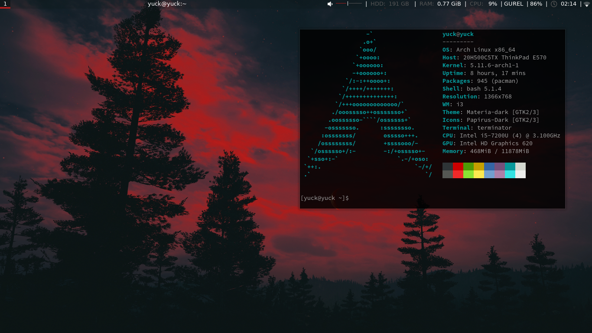
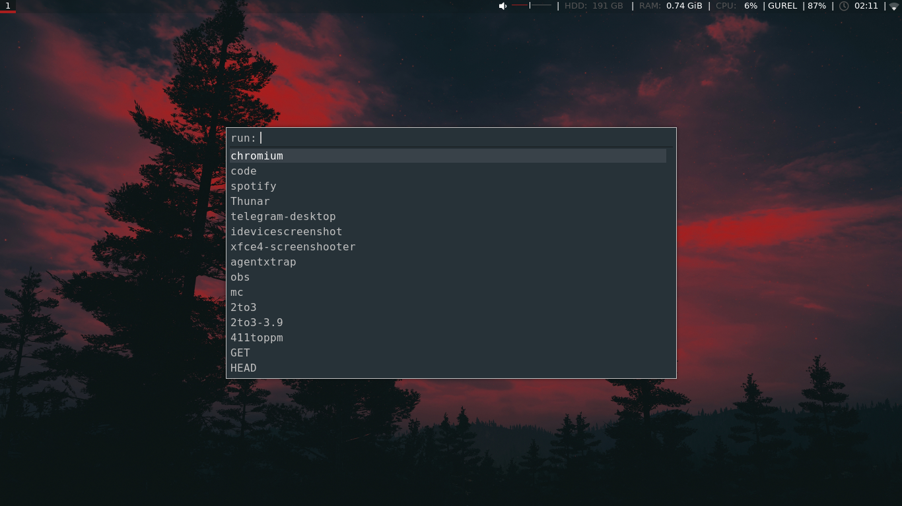
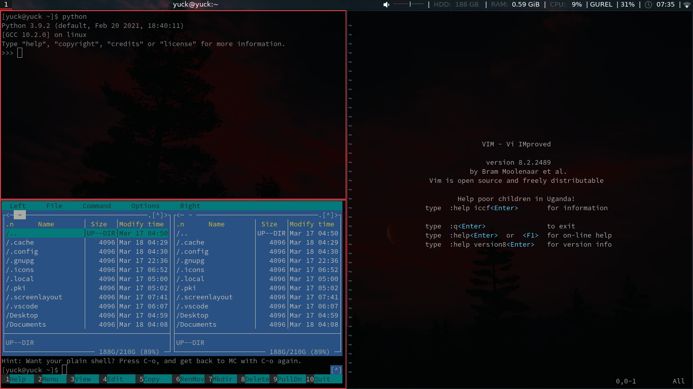

# My General Arch Layout & Customizations for i3WM

## Requirements

* i3WM
* i3-blocks (optional)
* i3-gaps
* polybar
* polybar-spotify
* Rofi
* Thundar
* Font Awesome 5

## Pre-Info & References

You should have intermediate GNU / Linux terminal knowledge to make these customizations. 
You can see my other infos on <b>neofetch</b> (theme, icons, shell).

For more information, please refer to the:    
* [i3wm](https://i3wm.org/docs/userguide.html)   
* [i3-gaps](https://github.com/Airblader/i3/wiki/installation)   
* [polybar](https://github.com/polybar/polybar/wiki)   
* [polybar-spotify](https://github.com/Jvanrhijn/polybar-spotify)   

<b><b>
## About

[My Website](http://yusufgurel.site) | [My Twitter](https://twitter.com/itisgurel) | [My Email](mailto:yusufgurel@outlook.com)

